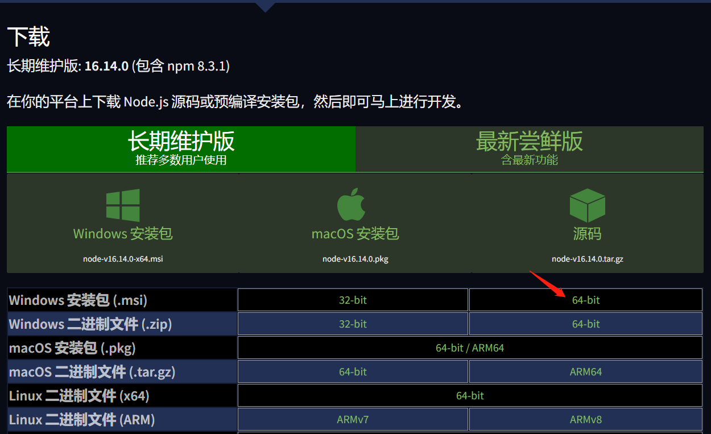
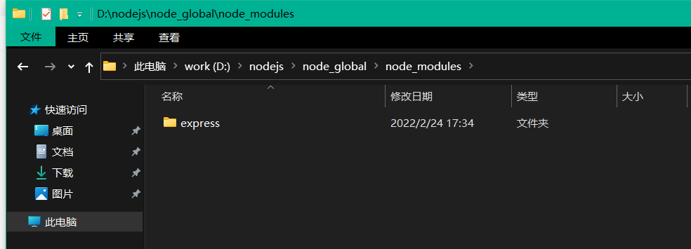

# Node

## (1) 下载安装Node

Node中文官网下载：<https://nodejs.org/zh-cn/download/>

一直next。

## (2) Node安装配置

`node -v` 显示安装的nodejs版本

`npm -v`  显示安装的npm版本

`cd D:\nodejs`  进入到node安装路径

`mkdir node_cache` 创建node_cache缓存文件夹

`mkdir node_global` 创建node_global全局文件夹

`npm config set prefix "D:\nodejs\node_global"`

`npm config set cache "D:\nodejs\node_cache"`

新建环境变量`NODE_HOME`值为`D:\nodejs\node_global\node_modules`

再在Path变量中加入

`D:\nodejs\node_global`

`D:\nodejs\node_global\node_modules\@vue\cli\bin`

`D:\nodejs\`

`%NODE_HOME%`

## (3) 更换npm镜像源

`npm config get registry`   查看当前镜像源

`npm config set registry "https://registry.npm.taobao.org/"`

## (4) 安装npm包

`npm install -g express`

